>## Diel 1: Ako elegantne dockerizovať webovú aplikáciu Django
Hendrik Frentrup https://faun.pub/tech-edition-how-to-dockerize-a-django-web-app-elegantly-924c0b83575d 
https://github.com/hendrikfrentrup/docker-django/tree/develop 

V tomto príspevku sa pokúsim dockerizovať aplikáciu Django elegantným spôsobom, to znamená využiť niektoré elegantné funkcie v Django a Docker, ako sú samostatne uložené premenné prostredia a migrácia údajov, aby bolo všetko bezpečné a plynulé. . V druhom článku to vezmem trochu ďalej smerom k produkčnému prostrediu. Zavedieme viac flexibility do našich prostredí a nastavíme reverzný proxy server.

Kód je možné skontrolovať aj v jeho úložisku GitHub . Postup krok za krokom je znázornený v protokole odovzdania.

### Predpoklady
Tento článok stavia na niekoľkých základoch ktoré treba mať nainštalované a ktoré sú:

* Docker & docker-compose
* Python 3.6.5 a Django 2.1
* virtualenv & pip
* git
* Pochopenie základov Djanga (napr. štúdiou tutoriálu Django resp. Djangogirls)
* Práca s terminálom vo windowsovsko resp. linuxovom prostredí pomocou Git Bash
* 
Nie je nutné byť odborníkom na tieto technológie, malo by stačiť len pochopenie. Malo by sa to dať aj tak sledovať, ale nebudem k nim poskytovať vysvetlenia.

### Nastavenie
Začneme vytvorením adresára projektu ( *mkdir docker-django*) a nastavením git repo ( *$ git init*). Aby som bol úprimný, zvyčajne najprv vytvorím repo na vzdialenom serveri git (tj GitHub v tomto prípade) a potom ho naklonujem lokálne - ušetrí to nejaké problémy s nastavením diaľkového ovládača. Okamžite vytvoríme a pokladníme novú vývojovú vetvu ( *$ git checkout -b develop*). Druhá časť nastavenia sa týka správy závislostí, takže vytvoríme virtuálne prostredie (*$ pip install virtualenv env*) a aktivujeme ho ( *$ . env/scripts/activate*). Potom nainštalujeme Django ( *$ pip install Django>=2.1*) Teraz toto nainštaluje Django lokálne do virtuálneho prostredia, o čo sa práve teraz snažíme. Na nastavenie projektu použijeme funkciu Djanga. Ale chceme tiež zachovať synchronizáciu našich závislostí pre iné prostredia, takže závislosť pridáme do súboru requirements.txt (*$ echo ‘Django>=2.1’ >> requirements.txt*) To si zaslúži prvé potvrdenie ( *git add .* && *$ git commit -m “…”*)

Tretiu časť nastavenia vykoná Django: Začnime projekt Django ( *$ django-admin startproject mysite .*). Ako editor používam Visual Studio Code, takže jeho nastavenie adresára vylúčim z kontroly verzií ( *$ echo “.vscode/” >> .gitignore*). Urobíme skúšobnú prevádzku nastavenia projektu spustením lokálneho servera ( *$ python manage.py runserver*) To by nám malo umožniť skontrolovať lokálne spustený server na http://localhost:8000 .

Dokončite nastavenie vykonaním ďalšieho rýchleho odovzdania (zvyčajné *$ git add . & $ git commit …*).

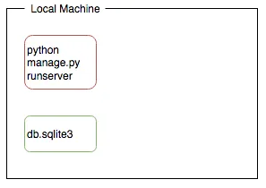
Obr.1: Typická situácia vo vývoji: lokálna aplikácia a databáza v lokálnom súborovom systéme.

„app“ teraz beží lokálne, čo sa často stáva počas vývoja. Samozrejme, nie je to rozsiahla aplikácia, ale to zatiaľ nie je dôležité. Tvrdil by som, že predvolený projekt Django sa už dodáva s dostatočným množstvom prostriedkov na to, aby sa z neho stala ako taká aplikácia, ako je napríklad app pre admina. Takže túto funkciu hneď použijeme aj na naš ďalší postup.

### Dockerizujte „app“
Teraz, keď sú položené základy, môžeme začať proces dokerizácie app. Všetko to začína súborom Dockerfile ( *$ touch Dockerfile*), ktorý by mal vyzerať asi takto:
~~~
FROM python:3.6.7-alpine
RUN apk update && \
    apk add --virtual build-deps gcc python-dev musl-dev
ENV PYTHONUNBUFFERED 1
RUN mkdir /code
WORKDIR /code
ADD requirements.txt /code/
RUN pip install -r requirements.txt
ADD ./ /code/
CMD ["python", "mysite/manage.py", "runserver", "0.0.0.0:8001"]
~~~
Vytvorí image založený na [oficiálnom image Pythonu z Docker Hub-u](https://hub.docker.com/_/python/) , skopíruje tento kód, nainštaluje obsah requirements.txt a spustíme app.

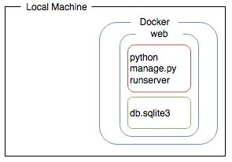
Obr.2:Aplikácia spustená v kontajneri Docker a s databázou vo vnútri kontajnera. Keď sa zrúti kontajner to ale vedie k strate údajov.

Spustíme vytváranie image ( *$ docker build -t docker-django:0.0.1 .*). Zvyčajne to chvíľu trvá, ale keď je to hotové, tak otestujte funkčnosť spustením našej „app“ v kontajneri ( *$ docker run -p 8001:8001 docker-django:0.0.1*). Keďže server spustený v kontajneri počúva na porte *8001* na rozdiel *8000* od našej „app“ ktorá je spustená lokálne, tak tu mapujeme port kontajnera 8001 na port nášho lokálneho počítača ktorý je 8001. Skontrolujeme to či to funguje na http://localhost:8001 .

Keď je image vytvorený a funguje správne, zmeníme ho na prvú službu web ktorú zadáme v novej definícii docker-compose.yml ( *$ touch docker-compose.yml*, tá by mala vyzerať takto:
~~~
version: '3.7'

services:
  web:
    build: .
    command: python manage.py runserver 0.0.0.0:8001
    ports:
      - "8001:8001"
~~~
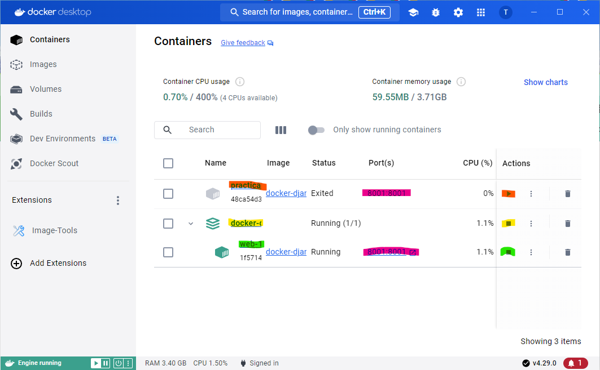
Obr.3: Zobrazenie aktivít kontajnerov v programe Docker Desktop

**Poznámka:**
Ak v príkaze *command: python manage.py runserver 0.0.0.0:8001* nepoužijeme adresu 0.0.0.0 tak on defaultne zoberie adresu 127.0.0.1 a tým nenastane po prepísaní adresy na *localhost* žiadne zobrazenie v internetovom prehliadači !!! V Dockerfile je totiž uvedená práve táto adresa t.j. 0.0.0.0 a ak ju neuvedieme v docker-compose.yml, tak data sú posielané na inú adresu (t.j. 127.0.0.1).

Teraz môžeme spustiť našu službu jednoducho s rýchlym *docker-compose up*. To je celkom úžasné a **je to v podstate to, k čomu sa chceme dostať, byť schopní spustiť našu aplikáciu jediným príkazom**. Príkaz na spustenie „app“ v kontajneri musíme zatiaľ spustiť so špecifikáciou adresy *0.0.0.0.* Je to preto lebo kontajnery majú svoju vlastnú sieť, *localhost* by odkazovalo iba na samotný kontajner. Všimnite si tiež, že by sme mali vypustiť z Dockerfile *CMD* a určiť, ktorý príkaz pre kontajner sa má spustiť v docker-compose.yml.

Takže naša „app“ nás informuje, že existujú neaplikované migrácie, konkrétne ďalšie aplikácie zahrnuté v štandardnom projekte Django a administrátorská konzola zatiaľ nie je k dispozícii, pretože tieto migrácie neboli aplikované. Ako prvý krok by sme mohli migrovať databázu v našom lokálnom repository ( *python manage.py migrate*). To by sa však vzťahovalo na lokálne *db.sqlite3* v našom súborovom systéme a administrátorská konzola by teraz bola prístupná iba v lokálne spustenej „app“ na http://localhost:8000/admin (za predpokladu, že je app spustená).

Ak chcete vykonať rovnakú migráciu proti kontajneru, môžeme vykonať príkaz v kontajneri (*$ docker-compose exec web python manage.py migrate*) a potom to môžeme skontrolovať: http://localhost:8001/admin

Všimnite si, že kontajner, ako aj server v ňom môžu byť v prevádzke a príkaz môžete spustiť *exec* samostatne v inom terminály. Je to v podstate rovnaké ako spustenie nového shellu, prihlásenie sa do kontajnera a vykonanie príkazu. Správcovská aplikácia je teraz prístupná, no zatiaľ neexistuje žiadny administrátor.

Pomôžeme si teda a vytvoríme v kontajneri administrátora. (*$ docker-compose exec web python manage.py createsuperuser*). Poďme ďalej a otestujte to v app admina – teraz by ste sa mali môcť prihlásiť do nástroja na správu a vidieť používateľa správcu, keď kliknete na „ Users“ .

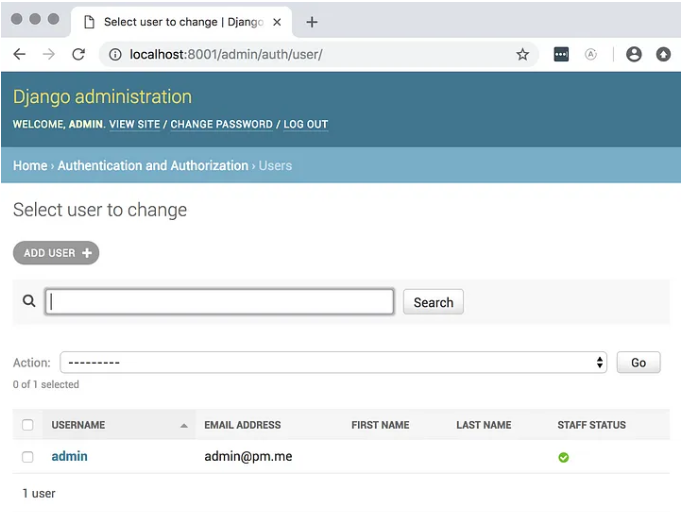
Obr.4: Po prihlásení sa do app pre admina by sme mali vidieť údaje z databáy db.sqlite3 našej aplikácie.

Vyzerá to skvele, ale teraz sme manuálne zmenili stav nášho kontajnera. Ak ho vykopeme a postavíme ho od nuly, musíme znova prejsť všetkými týmito krokmi, aby sme kontajner dostali späť do tohto stavu. Naše úsilie smeruje k tomu, aby sme sa tomu vyhli. Aby sme nestratili stav, vytvoríme zväzok (volumes) pre náš kontajner, aby náš kontajner a naše miestne vývojové prostredie mali prístup k rovnakým súborom:

~~~
volumes:
  - .:/code
~~~
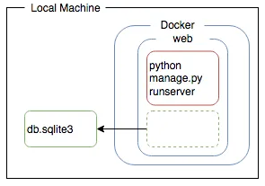
Obr.5: Mapovaním adresára vo vnútri kontajnera na lokálny súborový systém môžeme udržiavať lokálny stav a vnútro kontajnera v synchronizácii.

Náš lokálny aktuálny adresár je namapovaný v kontajneri na adresár *code*. Ako vedľajšia poznámka, lokálny súbor *db.sqlite3* je v mojom prípade vylúčený z kontroly verzií (z git-u), pretože som naklonoval repository zo vzdialeného servera, kde *.gitignore* bol automaticky vytvorený súbor pre Python, ktorý už tieto súbory SQLite označuje ako vylúčené.

Ak teraz zhodíme náš starý kontajner (*$ docker-compose down*) a reštartujeme všetky služby (*$ docker-compose up*), budeme späť ale bez superužívateľa. Pokračujme teda a zopakujme dva vyššie uvedené kroky v našom kontajneri (t.j. opetovné použitie *migrate* a *createsuperuser*). Teraz môžeme skontrolovať miestnu aj kontajnerovú aplikáciu a obe by mali byť teraz synchronizované, to znamená, že by sme sa mali môcť prihlásiť na http://localhost:8000/admin pomocou administrátora, ktorého sme práve nastavili. Ak tu zmeníme nejaké údaje, mali by sme vidieť rovnaké zmeny údajov v našej kontajnerovej aplikácii a databáza v lokálnom systéme súborov by teraz mala byť rovnaká ako v kontajneri Docker. To je celkom fajn.

To by bolo k príprave prostredia s Docker-om, ale my nakoniec chceme vyvinúť aplikáciu, takže začnime s app v rámci nášho projektu.
~~~
$ python manage.py startapp myapp
~~~
a súčasne do settings.py a časti INSTALLED_APPS pridáme *'myapp',*.

## Pridanie databázových služieb

S našou databázou SQLite by sme sa pravdepodobne dokázali dostať dosť ďaleko, pretože v súčasnosti je možné prevádzkovať obrovské servery v cloude, ale chceme vytvoriť aplikáciu, ktorá sa dá horizontálne škálovať a využíva plnohodnotnú databázu, ako je napr. Postgres. Prejdime teda na Postgres. Urobíme to pridaním databázovej služby, v skratke db, do nášho súboru docker-compose.yml:

~~~
db:
  image: postgres
  networks:
   - backend
networks:
  backend:
    driver: bridge
~~~

Používame tu [oficiálny image Postgres z Docker Hub](https://hub.docker.com/_/postgres/) a musíme tiež spojiť našu existujúcu službu *web* so službou *db* tým, že ich pridáme do rovnakej siete, aby mohli navzájom komunikovať.

## Premenné prostredia v Dockeri

Aby sme sa mohli pripojiť k databáze, musíme Djangovi poskytnúť podrobnosti o pripojení a poverenia pridaním databázy Postgres do settings.py:
~~~
POSTGRES_PASSWORD = os.environ.get('POSTGRES_PASSWORD') 
DATABASES = { 
    'predvolené': { 
        'ENGINE': 'django.db.backends.postgresql', 
        'NAME': 'postgres',                       
        'USER': 'postgres', 
        'PASSWORD': POSTGRES_PASSWORD, 
        'HOST': 'db', 
        'PORT': '5432', 
    } 
}
~~~

Heslo, ktoré tu definujeme, závisí od toho, čo sme pre službu *db* nastavili v inom kontajneri Docker. Aby sme udržali tieto informácie o prostredí synchronizované, použijeme samostatný súbor prostredia .env (skrytý pred užívateľom), ku ktorému majú prístup iba oba kontajnery a programátor a kam sa ukladajú tieto citlivé informácie o premenných prostredia ( *touch .env*). Ide o bežný, aj keď nie najlepší postup ochrany, ale iné osvedčené postupy ako zaobchádzať s údajmi ktoré by mali byť predmetom utajenia je však úplne iná téma a presahuje rámec tohto popisu.

Do súboru .env môžeme uložiť aj ďalšie tajomstvá, ako je Djangov tajný kľúč a ďalšie informácie, ktoré definujú naše aktuálne vývojové prostredie:

~~~
POSTGRES_PASSWORD=tajné 
POSTGRES_USER=postgres 
DJANGO_SECRET_KEY=tajné
~~~

Aby bolo možné nadviazať spojenie s Postgres, Django závisí od balíka Python *psycopg2*, takže túto závislosť nainštalujeme resp. pridáme do súboru requirements.txt:
~~~
Django>=2.1 
psycopg2-binary
~~~
Do nášho súboru Dockerfile pridajme tiež ďalšie závislosti  :
~~~
...
RUN apk update && \
    apk add --virtual build-deps gcc python-dev musl-dev && \
    apk add postgresql-dev
...
~~~

>###To znamená, že bude potrebná prestavba nášho image.
Referenciu k tomu môžeme vidieť [tu](https://github.com/hendrikfrentrup/docker-django/commit/b0e8e186ab275fb94c3c53f267ebe2853ef3d127).

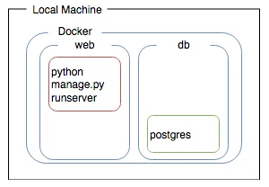
Obr.6: Samostatné služby web a db, môžu medzi sebou komunikovať.

To je naozaj všetko, mali by sme byť schopní znova spustiť všetky služby *$ docker-compose up*. A teraz sa môžeme pohrať s databázou Postgres.

## Migrácia údajov na automatické nastavenie superužívateľa

Mohli by sme znova manuálne spustiť migrácie na databázovú službu a potom otestovať našu aplikáciu a zistiť, či všetko funguje správne. 

My však pre tento prípad zvolíme postup kedy najprv vygenerujem prázdny migračný súbor 0001_initial.py do ktorého manuálne zapíšeme polia DB ktoré majú byť predmetom migrácie. Použijeme na to príkaz:
~~~
$ python manage.py makemigrations --empty myapp
~~~
Tým sa vytvorí prázdna migrácia s názvom 0001_initial.py, ktorú musíme manuálne doplniť aby sme ju dostali do takejto podoby:
~~~
import os
from django.db import migrations

class Migration(migrations.Migration):

    dependencies = []

    def generate_superuser(apps, schema_editor):
        from django.contrib.auth.models import User

        DJANGO_DB_NAME = os.environ.get('DJANGO_DB_NAME', "default")
        DJANGO_SU_NAME = os.environ.get('DJANGO_SU_NAME')
        DJANGO_SU_EMAIL = os.environ.get('DJANGO_SU_EMAIL')
        DJANGO_SU_PASSWORD = os.environ.get('DJANGO_SU_PASSWORD')
        
        superuser = User.objects.create_superuser(
            username=DJANGO_SU_NAME,
            email=DJANGO_SU_EMAIL,
            password=DJANGO_SU_PASSWORD)
        superuser.save()

    operations = [
        migrations.RunPython(generate_superuser),
    ]
~~~
Kedže v tomto súbore používame super uživateľa (superuser) tak je potrebné pred vlastnou migráciou ho vytvoriť. Poslúži nám k tomu príkaz:
~~~
$ docker-compose exec <your_django_container_id> python manage.py createsuperuser
~~~
kde <your_django_container_id> je meno alebo id webového kontajnera, lebo tamje nainštalovaný python. U nás je to meno *docker-django-web-1* resp. jeho id ktoré zistíme príkazom *docker ps*. Ale stačí aj keď ako meno použijeme **web**. Vytvorenie superužívateľa len ďalšou migráciou, ktorú na dosiahnutie tohoto zámeru musíme použiť. 

Ako alternatíva prichádza do úvahy najprv urobiť migráciu pokiaľ v minulosti bol už vytvorený superuser a keď treba tak pridať v druhom kroku ďalšieho superuser-a.

<u>Poznámka:</u> Ak by sme chceli použiť na to kontajner databazy db, museli by sme tam najprv nainštalovať python. Ale to už je iná kapitola.

Ak máme superuser-a vytvoreného môžeme pristúpiť k vastnej migráciu pomocou príkazu:
~~~
$ docker exec -it <your_django_container_id> python manage.py migrate 
~~~
kde <your_django_container_id> je opäť meno alebo id webového kontajnera. U nás je to meno *docker-django-web-1* resp. jeho id ktoré zistíme príkazom *docker ps*. Ale stačí aj keď ako meno použijeme **web**. 

Pri takomto postupe by nás mohlo unavovať spúšťanie migrácií a vytváranie superužívateľa, pretože to vyžaduje veľa zadávaných údajov. Ale ak to nechceme takto zakaždým robiť, keď spustíme našu aplikáciu musíme použiť iný postup. Ten spočíva v tom že aj poverenia pre superužívateľa by tiež mali byť uchovávané v rovnakom bezpečí ako ostatné poverenia a nemali by byť pevne vložené do kódu uloženého niekde v repository alebo odovzdávané ako argumenty príkazového riadku, ktoré zvyčajne končia v našej histórii bash.

>###Všetky premenné prostredia použité pri tejto migrácii musia byť špecifikované aj v našom súbore **docker-compose.yml**, ako aj v súbore **.env**, ale akonáhle sú, všetko sa zosynchronizuje. Pre začiatok je možné v settings.py a docker-compose.yml použiť priamo jednotlivé údaje a potom keď je funkcionalita overená nahradiť ich premennými.

~~~
services:
  web:
    [...]
    environment:
      POSTGRES_PASSWORD: ${POSTGRES_PASSWORD}
      POSTGRES_USER: ${POSTGRES_USER}
      DJANGO_DB_NAME: ${DJANGO_DB_NAME}
      DJANGO_SU_NAME: ${DJANGO_SU_NAME}
      DJANGO_SU_EMAIL: ${DJANGO_SU_EMAIL}
      DJANGO_SU_PASSWORD: ${DJANGO_SU_PASSWORD}
      DJANGO_SECRET_KEY: ${DJANGO_SECRET_KEY}
[...]
~~~

To nás privádza ku spornému bodu: Mali by sa migrácie automaticky aplikovať automaticky pri spúšťaní kontajnera? Niektorí ľudia to uprednostňujú týmto spôsobom, lebo im umožňuje spustiť aplikáciu jediným príkazom. 

Myslím si však, že migrácie by sa nemali robiť automaticky, pretože by to mohlo viesť k problémom vo výrobe. Napríklad webová aplikácia sa spustí v novom kontajneri a neúmyselne použije migráciu na produkčnú databázu. Čo ak spustíme viacero kontajnerov aplikácie? Súbežne by odštartovali migráciu. Môže to vyvolať problém. Doporučuje sa všakom, aby tento krok zostal manuálny a skôr by sme mali uľahčili rýchle použivanie migrácii definovaním aliasu shellu.

Iný a bežnejší postup spočíva v tom že najprv vytvoríme model v súbore models.py, na ktorý použijeme v ďalšom príkaz s makemigrations aby sme vygenerovali 0001_initial.py a potom uskutočníme migráciu príkazom:
~~~
$ docker exec -it <your_django_container_id> python manage.py migrate
~~~

kontrola migrácie 
$ docker exec -it docker-django-web-1 python manage.py showmigrations   
~~~
admin
 [X] 0001_initial
 [X] 0002_logentry_remove_auto_add
 [X] 0003_logentry_add_action_flag_choices
auth
 [X] 0001_initial
 [X] 0002_alter_permission_name_max_length
 [X] 0003_alter_user_email_max_length
 [X] 0004_alter_user_username_opts
 [X] 0005_alter_user_last_login_null
 [X] 0006_require_contenttypes_0002
 [X] 0007_alter_validators_add_error_messages
 [X] 0008_alter_user_username_max_length
 [X] 0009_alter_user_last_name_max_length
 [X] 0010_alter_group_name_max_length
 [X] 0011_update_proxy_permissions
 [X] 0012_alter_user_first_name_max_length
contenttypes
 [X] 0001_initial
 [X] 0002_remove_content_type_name
myapp
 [X] 0001_initial
 [X] 0002_auto_20240512_0837
sessions
 [X] 0001_initial

## Získajte lepší prehľad o našej službe `db` pomocou pgadmin

Na účely vývoja chceme mať možnosť vidieť našu schému Postgres a skúmať údaje. Teraz namiesto inštalácie klienta Postgres alebo používania nášho IDE na tento účel využijeme silu kontajnerov na nasadenie nástroja správcu. V skutočnosti naša služba *db* v súčasnosti nemá žiadne namapované porty na náš lokálny počítač, takže by sme sa k nej nemohli pripojiť pomocou lokálneho klienta JDBC. Pridajme teda do nášho súboru docker-compose.yml službu pgadmin. Oficiálny image som nenašiel, ale verejný je [tu](https://hub.docker.com/r/dpage/pgadmin4/) . Keďže ide len o pomocný image, rozhodneme sa mu dôverovať. Pre veci vo výrobe by sme to možno nechceli robiť. Takže súbor *docker-compose.yml* by potom v podstate vyzeral takto:
~~~
version: "3.8"

services:
  web:
    build: .
    command: python mysite/manage.py runserver 0.0.0.0:8001
    ports:
      - "8001:8001"
    volumes:
      - .:/code
    depends_on:
      - db
    networks:
      - backend
    environment:
      POSTGRES_PASSWORD: ${POSTGRES_PASSWORD}
      POSTGRES_USER: ${POSTGRES_USER}
      DJANGO_DB_NAME: ${DJANGO_DB_NAME}
      DJANGO_SU_NAME: ${DJANGO_SU_NAME}
      DJANGO_SU_EMAIL: ${DJANGO_SU_EMAIL}
      DJANGO_SU_PASSWORD: ${DJANGO_SU_PASSWORD}
      DJANGO_SECRET_KEY: ${DJANGO_SECRET_KEY}

  db:
    image: postgres
    environment:
      POSTGRES_PASSWORD: ${POSTGRES_PASSWORD}
      POSTGRES_USER: ${POSTGRES_USER}
    ports:
      - "5432:5432"
    networks:
      - backend

  db-admin:
    image: dpage/pgadmin4
    environment:
      PGADMIN_DEFAULT_EMAIL: ${PGADMIN_DEFAULT_EMAIL}
      PGADMIN_DEFAULT_PASSWORD: ${PGADMIN_DEFAULT_PASSWORD}
    depends_on:
      - db
    ports:
      - "8080:80"
    networks:
      - backend

networks:
  backend:
    driver: bridge
~~~

Opäť sa musíme uistiť, že potrebné premenné prostredia sú špecifikované aj v .env. Teraz je čas znova spustiť všetky služby a vyskúšať náš nástroj v Docker-ovom kontajneri docker-django-db-admin-1 (pre pgAdmin4) ktorý je určený na správu kontajnerovej DB Postgres na http://localhost:8080.

### Manuálne vytvorenie pgAdmin4 v Docker-i mimo docker-compose.yml
všeobecne
~~~
$ docker run -d --name pgadmin --network pgadmin-network -p 8080:80 -e PGADMIN_DEFAULT_EMAIL=tokos@comto.sk -e PGADMIN_DEFAULT_PASSWORD=admin -v pgadm
in-data:/var/lib/pgadmin dpage/pgadmin4
~~~
a v našom prípade
~~~
$ docker run -d --name pgadmin4-dev -p 5050:80 -e 'PGADMIN_DEFAULT_EMAIL=info@comto.sk' -e 'PGADMIN_DEFAULT_PASSWORD=admin' dpage/pgadmin4

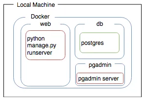
Obr.7: Tri samostatné služby sú spustené ako kontajnery, z ktorých každá je postavená na svoje individuálne účely a môžu medzi sebou komunikovať iba špecificky definovanými spôsobmi.

S prihlasovacími údajmi z premenných prostredia by sme sa mali vedieť prihlásiť. Ak chcete vytvoriť spojenie s našou databázou, kliknite na „Pridať server“. Tým sa otvorí model, v ktorom „Názov“ môže byť čokoľvek, čo chceme, povedzme „Test“, potom klikneme na kartu „Pripojenie“ a vyplníme dbnázov hostiteľa a naše poverenia databázy definované v súbore .env pre používateľské meno a heslo, takže pre príklady postgresa secret. Po nadviazaní spojenia s databázou – zobrazí sa výzva, ak sa to nepodarilo – môžeme prechádzať schémou a pozrieť sa na niektoré vzorové údaje v databáze. Šťastné dni pre administrátorov DB! Teraz, pre pohodlie, tiež odkryjeme port 5432nášho kontajnera, aby nám naše IDE mohlo ukázať schému klepnutím na localhost.

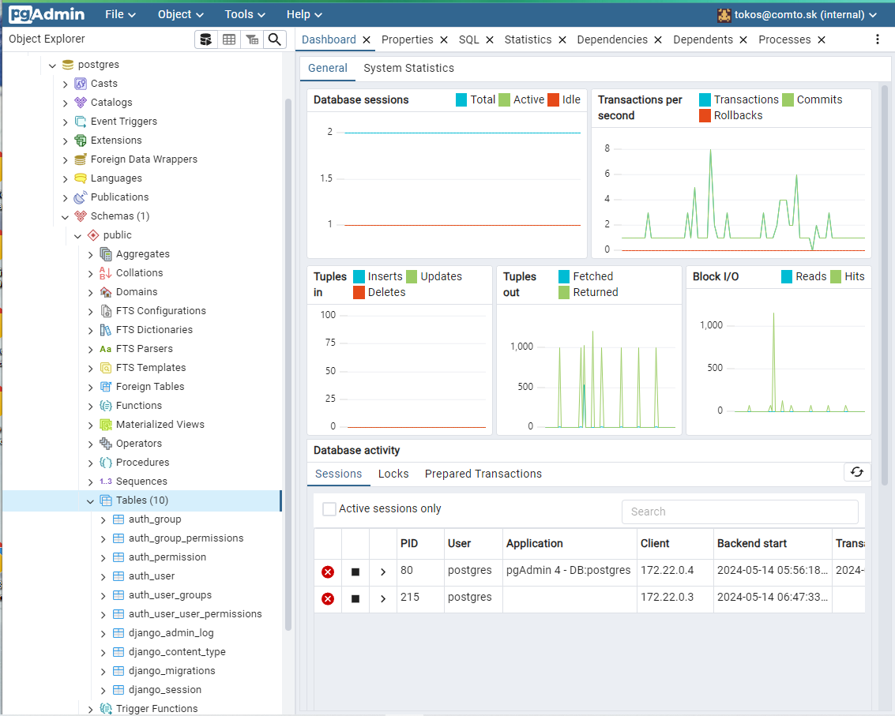

-------------------
>##Zhrnutie
V tomto štádiu už máme vytvorené celkom prehľadné vývojové prostredie. Veľkou **prednosťou tohto prístupu je jeho modularita**. Môžeme totiž jednotlivé moduly medzi spustením presúvať do a mimo lokálneho umiestnenia, na rozdiel od toho ak by boli umiestnené iba vo vnútri kontajnera. To závisí od toho, aké štádium vývoja práve prebieha t.j. či ide o vývoj, prípravu produkcie alebo ich kombináciu. Môžeme napr.spustiť individuálnu db službu v kontajneri a nechať s ňou komunikovať lokálnu aplikáciu. To sa dá však uskutočniť iba vtedy ak porty kontajnera sú vhodne namapované a aj nastavenia databázy sú nastavené správne. Tejto alternatíve zodpovedá nasledovná schéma. Je to vhodné vývojové prostredie, napríklad na účely ladenia aplikácie ktorá je spustená lokálne.

Obr.9: Nastavenie kedy lokálna aplikácia komunikuje s databázou v kontajneri. 

## Koniec prvej časti

---------------------------------------------------------------------------------------

>## Diel 2: Ako vložiť pred aplikáciu reverzný proxy nginx a ako zvládlnuť protokolovanie

V [druhej časti](https://medium.com/devopslinks/tech-edition-django-dockerization-with-bells-and-whistles-and-a-tad-bit-of-cleverness-2b5d1b57e289) sa rieši to ako vložiť pred aplikáciu reverzný proxy, ako je nginx, a ako by sme zvládli protokolovanie.

Toto je druhý článok ktorého predchodca sa zaoberal nastavením a v ktorom sme sa dostali stavu, kedy sme určité časti projektu preniesli z lokálneho behu vo vývojovom režime na beh v kontajneri vo vývojovom režime. Teraz sa pokúsime ponoriť trochu hlbšie do problematiky a pozrieme sa na to, ako môžeme použiť trochu šikovnosti, aby sme mali správny server v kontajneri, ktorý bude prevádzkovať vedľa seba lokálny vývojový server Django. Môžeme to použiť na ladenie, ale pokračujeme v testovaní vo výrobe.

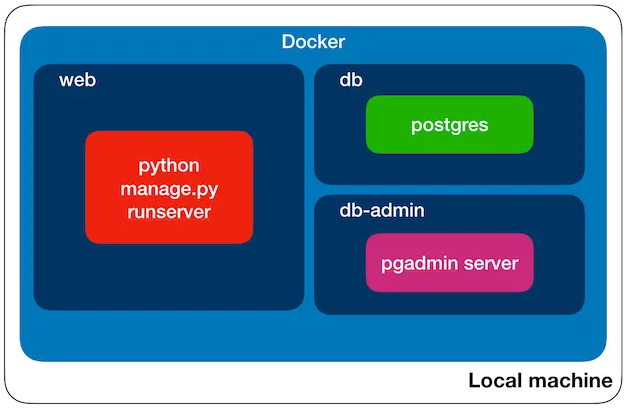
Obr.10: Takto sme skončili v predchádzajúcej časti kedy, všetko beží v kontajneroch čo je špecifické pre vývoj a zatiaľ to ani trochu nevonia produkciou.

## Oddeliť

V minulom článku sme spomenuli že by bolo dobré keby naša **databáza bežala v kontajneri** a **aplikácia bežala lokálne**. Náš systém sme však nastavili na spustenie aplikácie v kontajneri a spustenie lokálnej aplikácie momentálne nebolo možné.

Takže, čo ak chcem ale ladiť webovú aplikáciu ? Vo vnútri kontajnerov je ťažké ladiť. Rozhodne sa oplatí prevádzkovať lokálnu aplikáciu s ďalšími kontajnerovými službami. **Je dokonca možné spustiť lokálnu aplikáciu a kontajnerovú aplikáciu vedľa seba**, čo môže byť veľmi užitočné pri vývoji na testovanie vedľajších účinkov. Koniec koncov, chceme vytvárať škálovateľné aplikácie a tu je škálovanie súčasťou vývojového prostredia

Tak prečo to nefunguje? Po prvé, kontajnery sú spustené so všetkými špecifikovanými premennými prostredia ktoré nemáme lokálne k dispozícii v .env. Naša lokálne spustená aplikácia navyše nerozpozná hostiteľa db ktorý je špecifikovaný v našich nastaveniach Django, pretože kontajnerová databáza je namapovaná na port localhost-u.

Preto aby všetky lokálne aplikácie a kontajnery bežali vedľa seba, urobíme v našom súbore *settings.py* niekoľko malých zmien. Použijeme na to užitočný balík pythonu s názvom **[decouple](https://pypi.org/project/python-decouple/)**. Musíme ho teda pridať aj k našim požiadavkám v requirements.txt.

~~~
from decouple import config
SECRET_KEY = config(‘DJANGO_SECRET_KEY’)
...
DB_HOST = config(‘DJANGO_DB_HOST’, default=’localhost’)
POSTGRES_USER = config(‘POSTGRES_USER’)
POSTGRES_PASSWORD = config(‘POSTGRES_PASSWORD’)
...
~~~
Modul decouple je o niečo sofistikovanejší ako získavanie našej konfigurácie priamo z premenných prostredia ( napr. POSTGRES_PASSWORD = os.environ.get(‘POSTGRES_PASSWORD’)). Používa tiež užitočnú a bežne používanú hierarchiu na získanie konfigurácie: Najprv vyhľadá premennú prostredia, inak v koreňovom adresári projektu skontrolujte súbor .env, alebo použije predvolenú hodnotu. Vyhadzuje aj užitočné výnimky ako napr.
~~~
decouple.UndefinedValueError: MISSING_CONFIG not found. Declare it as envvar or define a default value.
~~~

Naša lokálne spustená aplikácia sa teda pokúsi nájsť súbor .env a prečítať si odtiaľ voliteľné parametre, ale iba v prípade, že nie sú nastavené priamo ako nastavenia prostredia. Všimnime si záložnú možnosť pre *DB_HOST* ktorá je *localhost* pretože toto priradenie v súbore .env nie je definované. Namiesto toho ju budeme špecifikovať v našom súbore *docker-compose.yml* v *environment:* pod webovou službou *web*:

Nastavenie databázy sa v settings.py zmení takto:
~~~
DATABASES = {
    'default': {
    'ENGINE': 'django.db.backends.postgresql',
    'NAME': 'postgres', 
    'USER': POSTGRES_USER,
    'PASSWORD': POSTGRES_PASSWORD,
    'HOST': DB_HOST,
    'PORT': '5432', 
  }
}
~~~

Pridáme *DJANGO_DEBUG=True* do nášho súboru .env. Teraz už len musíme spustiť náš kontajner v našom lokálnom prostredí a pridať požadovaný modul Python Postgres do nášho lokálneho virtuálneho prostredia ak tam ešte nie je( *pip install psycopg2-binary*).

Ak by sme chceli spustiť migráciu z nášho lokálneho počítača a vykonať zmeny oproti kontajnerovej databáze, potom by sme museli pri migrácii postupovať podobným spôsobom, ale je lepšie spustiť migráciu z kontajnera.

>###Presun aplikácie na spravujúci webový server a použitie proxy servera

V tomto štádiu vývoja stále prevádzkujeme vývojový server Django v našom kontajneri. V súvislosti s približovaním sa k produkčnému prostrediu ale nastal čas aby sme prešli na poriadny webový server a keďže veľa vývojárov v súčasnosti používa *nginx*, tak k tomu pristúpime aj my. Ob+cas v tejto s=uvislosti sa síce objavuje otázka že čo sa môže pri tom pokaziť ? Existuje však aj oficiálny repozitár [nginx](https://hub.docker.com/_/nginx/). Poďme ďalej a pridáme nginx na koniec s=uboru docker-compose.yml ako službu:
~~~
  nginx:
    image: nginx:latest
    ports:
      - "8088:80"
    networks:
      - backend
~~~

Namapovali sme tu nginx-ov port 80 na náš localhostport 8088. Nemusíme sa pritom obávať, že by nám minuli porty, pretože celkovom máme k dispozícii ďalších 60 000 (presnejšie 2¹⁶).

Na stránke http://localhost:8088 skontrolujte, či je spustená. Áno, vyzerá to dobre. Tiež si môžeme všimnúť logline nginx v termináli, kde sme spustili naše kontajnery:
~~~
nginx_1 | 192.168.0.1 — — [05/Dec/2018:10:18:31 +0000] “GET / HTTP/1.1” 304 0 “-” “<some User-Agent stuff>” “-”
~~~

Takže tento proxy server nginx nám pomôže zvládnuť požiadavky a obsluhovať statické súbory, pridaním konfiguračného súboru. Ale najprv musíme pre neho vytvoriť v koreni adresár a súbor:
~~~
mkdir nginx 
touch nginx/default.conf
~~~

Taká naozaj jednoduchá konfigurácia by vyzerala asi takto:
~~~
server {
 listen 80;
 server_name localhost;
location / {
 proxy_pass http://web:8001;
 }
}
~~~

Takže hovoríme nginx-u, aby počúval na porte 80 a preposielame požiadavky z tohoto portu **/** na našu webovú službu ktorá je na porte 8001. Zároveň pridajme službu nginx v docker-compose.yml do rovnakej siete ako je webová služba *web*. Uistite sa, že je web zapnutý a spustíme, keď spustíme nginx a tiež umiestnime konfiguračný súbor z nášho lokálneho úložiska tam, kde by mal byť v kontajneri mapovaním zväzku:
~~~
volumes:
      - ./nginx/default.conf:/etc/nginx/conf.d/default.conf
    networks:
      - backend
    depends_on:
      - web
~~~

Teraz tiež zmeníme kontajner tak, aby spustil webový server správy kde je umiestnená naša aplikácia namiesto jednoduchého vývojového servera Django ktorý sme používali doteraz. Rozhodneme sa pre **gunicorn**, takže to pridáme k našim požiadavkám:
~~~
echo “gunicorn” >> requirements.txt
~~~
Ak v tomto štádiu zadáme do prehliadača URL http://localhost:8088/, tak dostaneme nasledovnú stránku :
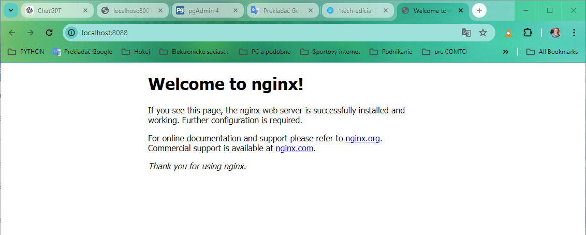
Obr.12: Zavolanie servera nginx bez toho aby bol Django v režime ladenia

Pretože naším zámerom je spustiť ladiaci server Django lokálne a gunicorn v kontajneri, je úplne voliteľné nainštalovať gunicorn aj lokálne tak je potrebné použiť iba jeden prikaz command a použiť **&&**. Nemá zmysel spúšťať oba súčasne, pretože slúžia na rovnaký účel (slúžia webovej aplikácii). Mali by ste si vybrať jeden. Na výrobu by ste zvyčajne použili Gunicorn. Ak chceme spustiť iba server gunicorn v našom kontajneri, nahradíme ekvivalentný príkaz pre Django vo webovej službe web v docker-compose.yml príkazom pre gunicom ktorý je nasledovný :
~~~
command: gunicorn mysite.wsgi — bind 0.0.0.0:8001
~~~

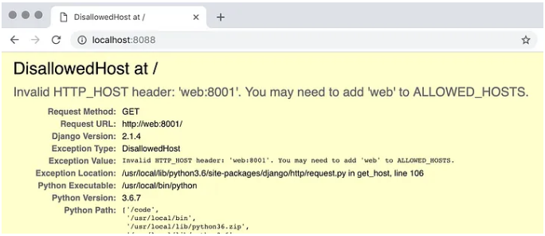
Obr.12: Ak je Django v režime ladenia, zobrazí sa táto „priateľská“ chybová stránka.

Nateraz pridajme oboch t.j. 'localhost' ako aj nášho WEB_HOST do zoznamu povolených hostiteľov v našom Django settings.py. To nám umožňuje prístup k našej webovej aplikácii, keď je spustená lokálne, ako aj v kontajneri.
~~~
ALLOWED_HOSTS = [WEB_HOST, 'localhost']
~~~

V opačnom prípade by sme mohli naraziť na chybovú stránku s textom „DisallowedHost“ (ak je Django v režime ladenia) alebo len s chybou Bad Request (400).

Ak sa teraz pozrieme na našu službu nginx na http://localhost:8088/admin , zobrazí sa nám naša prihlasovacia stránka správcu, ale vyzerá inak, ako sme zvyknutí. Je to preto, že náš server gunicorn nie je určený na poskytovanie statických súborov, takže budeme musieť nakonfigurovať nginx, aby namiesto toho obsluhoval statické súbory. Za týmto účelom pridávame do nášho default.conf:

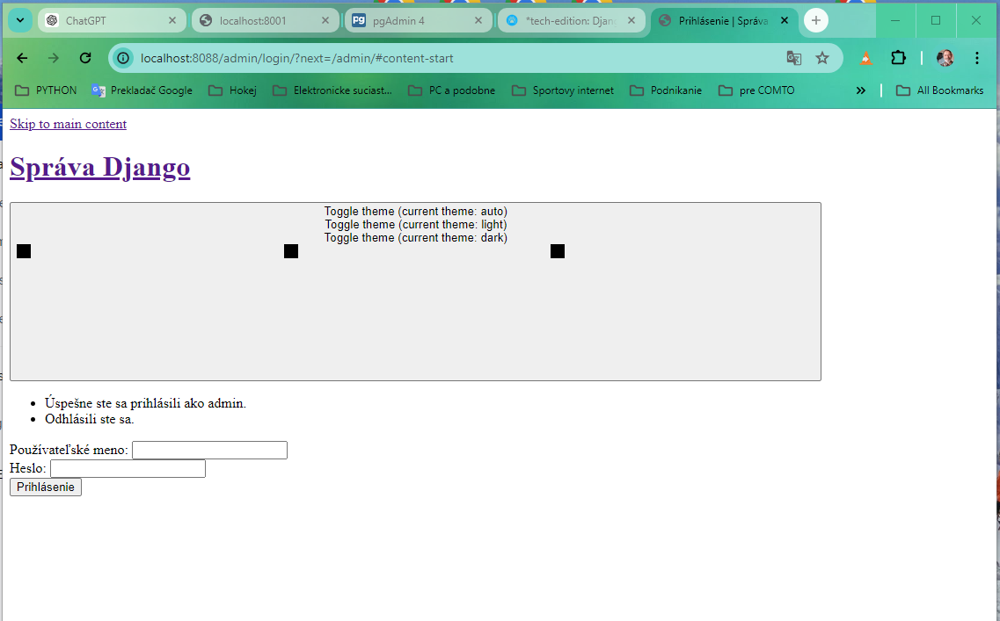
Obr.13: Obrazok znamená, že náš server nginx presmeruje požiadavky na náš server Django, ktorý beží v samostatnom kontajneri, ale nepridáva statické súbory, ako sú šablóny so štýlmi CSS.

Celkový obsah súboru default.conf ktorá to spôsobí a ktorý nám poskytla OpenGPT je nasledovný:
~~~
server {
    listen 80;
    
    server_name localhost;

    location / {
        proxy_pass http://web:8001;
        proxy_set_header Host $host;
        proxy_set_header X-Real-IP $remote_addr;
        proxy_set_header X-Forwarded-For $proxy_add_x_forwarded_for;
        proxy_set_header X-Forwarded-Proto $scheme;
    }

    location /static/ {
        alias /code/static/;
    }

    location /media/ {
        alias /code/media/;
    }
}
~~~

Ako vyplýva z predchádzajúceho odstavca, v ďalšom kroku je potrebné aby sme zabudovali statické súbory používané v Djangu. Najprv povedzme Djangovi v *settings.py*, kde má hľadať náš adresár pre statické súbory:
~~~
STATIC_ROOT = os.path.join(BASE_DIR, 'statický')
~~~

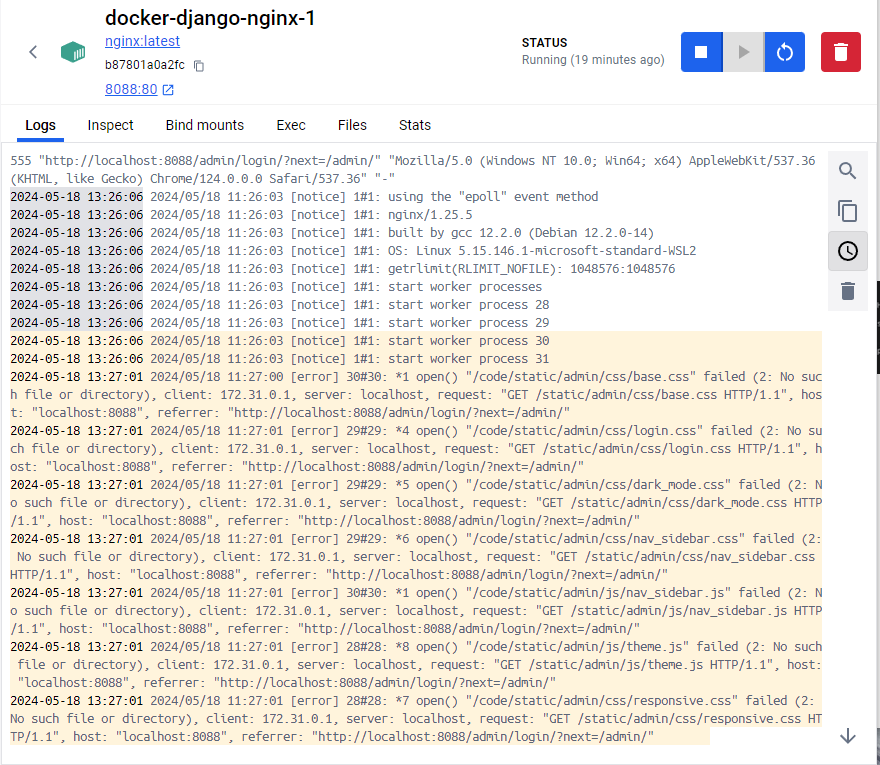
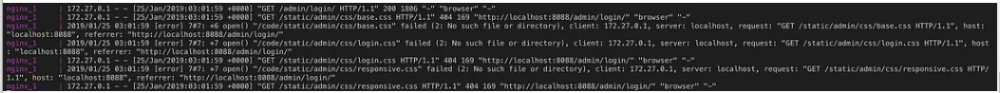
Obr.13: Protokoly nginx podrobne ukazujú, ktoré súbory sa nenašli. Zatiaľ čo sa stránka správcu úspešne vracia (stavový kód 200), tak  žiadny nebol k dispozícii na poskytovanie službou nginx.

Doplnme preto náš súbor docker-compose.yml vo volumes pre službu nginx, aby sme namapovali aj náš lokálny adresár so statickými súbormi do adresára v našom kontajneri pre ngnix ktorý by mal celkovo vyzerať:
~~~
volumes:
  - ./nginx/default.conf:/etc/nginx/conf.d/default.conf
  - ./mysite/static:/code/static
~~~

Nakoniec musíme spustiť príkaz:
~~~
$ python manage.py collectstatic 
~~~
aby sa všetky statické súbory pre našu aplikáciu stiahli do zvoleného adresára. Rozdiel by sme mali vidieť obnovením našej stránky na http://localhost:8088/admin — teraz by nám to malo byť známe. Keď ale navštívime našu webovú službu priamo na http://localhost:8001 , vidíme, že statické súbory sa nedajú nájsť, pretože ich obsluhuje služba nginx.

Obr.14:Teraz to vyzerá dobre, všetko bolo nájdené a doručené so stavovým kódom 200.

Obr.15:Obviklý a známi dizajn administrátorskej stránky s použitím CSS v adresári static\admin

Môžeme tiež vidieť, že v našich log file-och sú tieto veci zaznamenané. Informácií je tam pomerne dosť. Napríklad nginx nás informuje o všetkých súboroch, ktoré obslúžil na žiadosť, ktorú sme práve odoslali, a stavové kódy 200, čo znamená úspech, sú dobrou správou. Favicon sa však nepodarilo nájsť, pretože nás na to upozorňuje aj denník webového servera. Zatiaľ len pridáme tento riadok do našej konfigurácie nginx, aby sa prestal sťažovať na favicon:
~~~
location = /favicon.ico {
  access_log off;
  log_not_found off; 
}
~~~

Ok, tento balík je zatiaľ v celkom dobrom stave. Zabezpečme ešte aby údaje našej služby *db* sa uchovávali tým že budú ukladané na lokály zväzok čo uskutočníme mapovaní (použitie :). Je to veľmi podobné tomu, čo sme urobili pre údaje SQLite (Nezabudnime tiež pridať tento adresár do nášho .gitignore!).
~~~
volumes:
  - postgres_data:/var/lib/postgresql/data  # uchova to data
~~~

Pri vytváraní architektúry systému našej aplikácie sme sa dostali do štádia ktoré zodpovedá nasledovnému obrázku. Tu ukončíme jej konštrukciu nakoľko obsahuje všetky základné prvky ako aplikačný server spolu s lokálne spustenou aplikáciou, špecializovanú databázovú službou v kontajneri, službou proxy a voliteľnou službou správcu databázy ktoré sú umiestnené tiež v kontajneroch Docker-a.
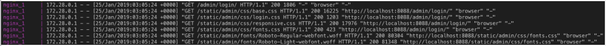
Obr.16: Konečná architektúra nášho systému 

>###Plody našej práce

Krátke zhrnutie toho, ako vyzerá naše nastavenie. Teraz máme viacero služieb, ktoré bežia vedľa seba:

* Náš hlavný koncový bod, služba nginx ( http://localhost:8088 )
* Priamy koncový bod servera aplikácie ( http://localhost:8001 )
* Koncový bod správcu Postgres ( http://localhost:8080 )
* Naša Postgres služba *db*  počúva na pripojenia (ale nie na požiadavky HTTP) (localhost:5432)
* Ak spustíme aplikáciu lokálne, môžeme k nej tiež pristupovať ( http://localhost:8000 )

Povedal by som, že sme sa už dostali tak ďaleko ako tomu bolo pri počiatočnej verzii tutoriálu Django.  Okrem lokálnej aplikácie vieme totiž všetky vyššie vyšie uvedené procesy spustiť vykonaním iba jedeného jednoduchého príkazu: *docker-compose up*. Takmer celá naša infraštruktúra je definovaná v kóde a konfigurácia je transparentná. Uľahčili sme si život aj tým, že migrácia údajov riešila vytvorenie superužívateľa. Aj na spustenie čistého projektu bez databázy nám stačí spustiť iba tieto dva príkazy:
~~~
docker-compose up 
docker-compose exec web python manage.py migrovať
~~~

Áno samozrejme, budeme musieť pridať ešte súbor *.env* a vytvoriť virtuálne prostredie – je to však niečo, čo by sa v určitom okamihu mohlo automatizovať. Naša databáza je však zachovaná, takže ak zničíme naše kontajnery, môžeme začať všetko od nuly a náš administrátor je stále prítomný a môžeme sa prihlásiť do *admin/*koncového bodu a tiež do služby *db-admin*.

Teraz by bolo rozumné trochu opatrnejšie oddeliť konfiguráciu pre naše rôzne prostredia (dotenv, decouple a pod.) a Docker má niektoré k tomu elegantné funkcie. Najprv presunieme všetky naše konfigurácie špecifické pre migráciu ako je napríklad vytvorenie nášho superužívateľa do samostatného súboru YAML ( *docker-compose.migrate.yml*). Poďme spojiť všetky úlohy nastavenia do jedného bash skriptu, ktorý sa vyvolá v tomto špecifickom kontajneri, ako je zhromažďovanie statických aktív a spustenie migrácií. Ako vedľajšia poznámka, táto služba bude musieť počkať, kým bude databáza v službe db pripravená na prijímanie spojení, inak spadne. Toto sa nazýva [riadenie poradia spustenia](https://docs.docker.com/compose/startup-order/). Našťastie existuje úhľadný malý [bash skript](https://github.com/eficode/wait-for), ktorý môžeme použiť na to, aby služba migrácie skontrolovala, či sú služby pripravené. Naša služba sa spúšťa pomocou nasledujúcich príkazov, ktoré čakajú na prípravu databázových pripojení a spúšťa migráciu ako kolektív:
~~~
command: [“./wait-for.sh”, “db:5432”, “ — “, “./run-migrations.sh”]
~~~
Obsah suboru run-migrations.sh:
~~~
!/bin/sh

echo "Collect static assets"
python manage.py collectstatic --no-input

echo "Apply database migrations"
python manage.py migrate

exit 0
~~~
Všetky správcovské úlohy, ktoré sa majú spustiť, môžeme spojiť v kontajneri v tomto skripte shellu, ktorý sa má spustiť.

Tieto jednorazové úlohy môžeme spustiť explicitným nasmerovaním Dockera na tento súbor YAML a po dokončení sa uistite, že ste kontajner odstránili:docker-compose -f docker-compose.migrate.yml run migrate -d — rm

V tomto bode sa riaďme podobným prístupom a presunieme celú konfiguráciu špecifickú pre vývoj do **docker-compose.override.yml**. Docker automaticky prečíta tento súbor a použije ho na prepísanie konfigurácie v základni **docker-compose.yml**. Takto môžeme oddeliť príznaky ladenia, správcovské konzoly, otvorené porty a mapovanie adresárov od základných definícií služieb.

## Logging

Na záver sa dotknime témy loggingu. Tejto témy sa len dotkneme, pretože tejto téme je venovaných veľa článkov. V skutočnosti sa totiž protokolovanie do ktorého spadá aj vytváranie logov t.j. logging zmenilo na celé odvetvie – existuje viacero spoločností ako Splunk a SumoLogic, ktoré ponúkajú spravované riešenie na spracovanie protokolovania. Takéto služby ponúkajú aj všetci poskytovatelia cloudu a často má zmysel zoznámiť s takýmto riešením skôr, ako začnete sami spravovať agregátory protokolov. Konkrétne, ak je vaším cieľom rozvíjať sa. Takže, kým sme na lokálnom počítači, t.j. na našich notebookoch alebo PC, budeme udržiavať naše záznamy v štandardnom výstupe na obrazovku. To je najpriamejší spôsob, ako sledovať veci. Všetky aplikácie a služby v kontajneroch by sa však tiež mali streamovať, *stdout* pretože tam docker zachytí tieto protokoly a prenesie ich do vášho miestneho súboru *stdout*. Teraz má Docker aj mnoho ďalších spôsobov, ako spracovať protokolovanie, a to je možné špecifikovať ovládačmi protokolovania pre každú službu jednotlivo.

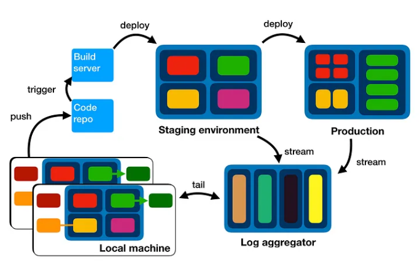
Obr.18: Integrácia logovacieho systému do prostredia CI.

CI (Continuous Integration) je nastavenie, ktoré sa používa na automatické vytváranie, testovanie a nasadzovanie zmien kódu konzistentným a spoľahlivým spôsobom. Prostredia CI sú nevyhnutné pri vývoji moderného softvéru, aby sa zabezpečilo, že zmeny kódu sú často integrované a že sa chyby včas zistia. 

Ako by sa logovací systém mohol integrovať do prostredia CI ? Kód sa zapíše a odošle do úložiska, čo spustí zostavenie na dedikovanom serveri. Postavené artefakty sú nasadené do inscenačných prostredí. End-to-end testy prebiehajú v prípravných prostrediach, ktoré streamujú protokoly do agregátora protokolov, ktorý vývojári používajú na monitorovanie toho, čo sa deje. Pokiaľ veci fungujú, softvér sa presúva do výroby, ktorá tiež pumpuje svoje protokoly do agregátora protokolov.

Mohli by sme teda spustiť aj agregátor protokolov v kontajneri Docker a [tento image](https://hub.docker.com/r/sebp/elk) obsahuje celý ELK – to znamená ElasticSearch, LogStach a Kibana. V tomto bode sa však veci stanú komplikovanými. V závislosti od toho, ktorý ovládač protokolovania sa rozhodneme, by sme mohli skončiť odosielaním protokolov priamo do ElasticSearch, ale iné by streamovali do služieb LogStach, zatiaľ čo iné možnosti by vyžadovali samostatnú službu na spracovanie protokolov zo všetkých miest a ich odoslanie na príslušné miesto určenia. . Pokojne choďte do tej králičej nory a žasnite nad tým, aké zložité budú veci. Nie je potrebné vysvetľovať, prečo spravujú služby agregácie protokolov dobré podnikanie. Ak teda v skutočnosti nenastavujete zdieľané pracovné alebo produkčné prostredia, nechajte protokoly vo fáze vývoja prejsť na štandardný výstup.

### Koniec druhej časti

>##Otázka: Ako a kde deploy zadarmo django aplikáciu s postgresql, Docker, nginx a gunicorn

Odpoveď OpenGPT je:

Nasadenie aplikácie Django s PostgreSQL, Docker, Nginx a Gunicorn zadarmo zahŕňa **použitie cloudovej služby**, ktorá ponúka bezplatné úrovne, ako napríklad *Heroku, Vercel alebo Render*. Tu je podrobný návod na **nasadenie vašej aplikácie na Heroku**, ktorý je široko používaný a poskytuje jednoduchý spôsob nasadenia dockerizovaných aplikácií.

1

>##Heroku - [Cloudová platforma za zaujímavé peniaze](https://medium.com/@alisdair_/top-heroku-alternatives-in-2024-6d6831cb6e08)

## Podrobný sprievodca nasadením na Heroku

### Predpoklady:

1. Účet Heroku : Vytvorte si bezplatný účet na Heroku .
2. Docker : Nainštalujte Docker na svoj lokálny počítač.
3. Heroku CLI : Nainštalujte Heroku CLI z Heroku CLI .

>###Krok 1: Pripravte si aplikáciu Django

Uistite sa, že vaša aplikácia Django je nakonfigurovaná na používanie PostgreSQL a že ste aplikáciu dockerizovali. Váš projekt by mal obsahovať nasledujúce súbory:

* Dockerfile
* docker-compose.yml
* requirements.txt
* .env
* nginx/default.conf
* Procfile

Tu je príklad konfigurácie:

**Dockerfile**
~~~
FROM python:3.8-slim

# Set environment variables
ENV PYTHONDONTWRITEBYTECODE 1
ENV PYTHONUNBUFFERED 1

# Install dependencies
RUN pip install --upgrade pip
COPY requirements.txt /app/
RUN pip install -r /app/requirements.txt

# Copy project
COPY . /app/
WORKDIR /app/

# Expose port 8000
EXPOSE 8000

# Run the application
CMD gunicorn mysite.wsgi:application --bind 0.0.0.0:8000

~~~

**docker-compose.yml**
~~~
version: '3.8'

services:
  web:
    build: .
    command: gunicorn mysite.wsgi:application --bind 0.0.0.0:8000
    volumes:
      - .:/app
    ports:
      - "8000:8000"
    env_file:
      - .env
    depends_on:
      - db

  db:
    image: postgres:13
    volumes:
      - postgres_data:/var/lib/postgresql/data
    environment:
      POSTGRES_DB: ${POSTGRES_DB}
      POSTGRES_USER: ${POSTGRES_USER}
      POSTGRES_PASSWORD: ${POSTGRES_PASSWORD}

  nginx:
    image: nginx:latest
    ports:
      - "80:80"
    volumes:
      - ./nginx/default.conf:/etc/nginx/conf.d/default.conf
    depends_on:
      - web

volumes:
  postgres_data:
~~~

**nginx/default.conf**
~~~
server {
    listen 80;
    server_name localhost;

    location / {
        proxy_pass http://web:8000;
        proxy_set_header Host $host;
        proxy_set_header X-Real-IP $remote_addr;
        proxy_set_header X-Forwarded-For $proxy_add_x_forwarded_for;
        proxy_set_header X-Forwarded-Proto $scheme;
    }
}
~~~

**Profile** - command riadok z docker-compose.yml s pridaním portu
~~~
web: gunicorn mysite.wsgi:application --bind 0.0.0.0:$PORT
~~~

**request.txt** - obsah requirements.txt
~~~
Django>=3.2,<4.0
gunicorn
psycopg2-binary
django-environ
~~~

**.env**
~~~
DEBUG=False
DJANGO_SECRET_KEY=your_secret_key
POSTGRES_DB=your_db
POSTGRES_USER=your_user
POSTGRES_PASSWORD=your_password
~~~

>###Krok 2: Vytvorte aplikáciu Heroku

[Registrujte a prihláste](https://www.heroku.com/) sa na Heroku a vytvorte tam svoju aplikáciu s názvom your-app-name:
~~~
heroku login
heroku create your-app-name
~~~

>###Krok 3: Nastavte PostgreSQL na Heroku
~~~
heroku addons:create heroku-postgresql:hobby-dev
~~~

>###Krok 4: Posuňte svoju ukotvenú aplikáciu do Heroku

1. Prihláste sa do registra kontajnerov Heroku
~~~
heroku container:login
~~~

2. Zatlačte svoj kontajner Docker
~~~
heroku container:push web -a your-app-name
~~~

3. Uvoľnite kontajner
~~~
heroku container:release web -a your-app-name
~~~

>###Krok 5: Nastavte premenné prostredia
~~~
heroku config:set DJANGO_SECRET_KEY=your_secret_key -a your-app-name
heroku config:set POSTGRES_DB=your_db -a your-app-name
heroku config:set POSTGRES_USER=your_user -a your-app-name
heroku config:set POSTGRES_PASSWORD=your_password -a your-app-name
~~~

>###Krok 6: Spustite migrácie a zbierajte statické súbory
~~~
heroku run python manage.py migrate -a your-app-name
heroku run python manage.py collectstatic --noinput -a your-app-name
~~~

>###Krok 7: Otvorte svoju aplikáciu
~~~
heroku open -a your-app-name
~~~

## Ďalšie možnosti bezplatného nasadenia

* Vercel : Skvelé pre front-end a full-stack aplikácie, ale môže vyžadovať určité úpravy pre backend náročné aplikácie ako Django.
* Render : Podobne ako Heroku, s veľkorysou bezplatnou úrovňou.

## Záver
Podľa týchto krokov môžete bezplatne nasadiť svoju aplikáciu Django s PostgreSQL, Docker, Nginx a Gunicorn na Heroku. Toto nastavenie zaisťuje, že vaša aplikácia je škálovateľná, bezpečná a pripravená na produkciu.

>##Render - Cloudová platforma pre nasadenie (hosťovanie) webových aplikácii
 
 Ak chcete nainštalovať a používať Render (za predpokladu, že máte na mysli Render ako cloudovú platformu na nasadenie webových aplikácií a nie konkrétnu knižnicu alebo nástroj na vykresľovanie), postupujte takto:

1. Zaregistrujte sa a nastavte si účet
  * Prejdite na webovú stránku Render .
  * Zaregistrujte si účet, ak ho ešte nemáte.

2. Pripravte si žiadosť
  * Uistite sa, že vaša aplikácia je pripravená na nasadenie. To zahŕňa mať správnu Dockerfilealebo package.jsonak ide o aplikáciu Node.js, aplikáciu requirements.txtpre Python atď.
  * Uistite sa, že vaša aplikácia je uložená v úložisku Git (GitHub, GitLab, Bitbucket atď.).

3. Vytvorte novú webovú službu v Renderi
  * Prihláste sa do svojho účtu Render.
  * Kliknite na tlačidlo „Nový“ na paneli Render.
  * V rozbaľovacej ponuke vyberte možnosť „Webová služba“.

4. Pripojte svoje úložisko
  * Render vás vyzve na pripojenie vášho účtu GitHub, GitLab alebo Bitbucket.
  * Vyberte úložisko, ktoré obsahuje vašu aplikáciu.

5. Nakonfigurujte svoju službu
  * Render automaticky rozpozná príkazy na zostavenie a spustenie pre bežné rámce. V prípade potreby si ich môžete prispôsobiť.
  * Zadajte prostredie (Node.js, Python, Ruby atď.).
  * Nakonfigurujte príkaz build a príkaz start. Napríklad:
    * Príkaz na zostavenie: npm install (pre Node.js)
    * Štart príkaz: npm start (pre Node.js)
  * Nastavte premenné prostredia, ak ich vaša aplikácia vyžaduje.

6. Nasaďte svoju aplikáciu
  * Kliknite na tlačidlo „Vytvoriť webovú službu“.
  * Render spustí proces nasadenia. Priebeh môžete sledovať na paneli Render.
  * Po nasadení poskytne Render adresu URL, na ktorej je vaša aplikácia prístupná.

7. Spravujte svoje nasadenie
  * Svoje nasadenie môžete spravovať z ovládacieho panela Render.
  * Možnosti zahŕňajú nastavenie vlastných domén, prezeranie denníkov, konfiguráciu premenných prostredia, škálovanie vašej služby a nastavenie automatických nasadení z vášho úložiska Git.

###Príklad: Nasadenie aplikácie Node.js

Predpokladajme, že máte jednoduchú aplikáciu Node.js. Váš package.json môže vyzerať takto:
~~~
{
  "name": "myapp",
  "version": "1.0.0",
  "main": "index.js",
  "scripts": {
    "start": "node index.js"
  },
  "dependencies": {
    "express": "^4.17.1"
  }
}
~~~

1. Vytvorte startskript vo svojom package.json:
~~~
"scripts": {
  "start": "node index.js"
}
~~~

2. Vložte svoj kód do úložiska Git (napr. GitHub).

3. Pri vykreslení:
  * Vytvorte novú webovú službu.
  * Pripojte sa k svojmu úložisku GitHub.
  * Render automaticky rozpozná príkazy build ( npm install) a start ( npm start).
  * Kliknite na „Vytvoriť webovú službu“.

4. Prístup k aplikácii:
  * Po nasadení vám Render poskytne URL (napr. https://myapp.onrender.com).

### Tipy na používanie Renderu
* Vlastné domény: Nastavte si vlastné domény v nastaveniach svojej služby.
* Premenné prostredia: Pridajte premenné prostredia priamo z panela Render na karte „Prostredie“.
* Automatické škálovanie: Povoľte automatické škálovanie, ak vaša aplikácia potrebuje zvládať rôzne dopravné zaťaženie.
* Monitorovanie: Pomocou vstavaných monitorovacích nástrojov sledujte výkon a stav svojej aplikácie.

Render poskytuje priamy a efektívny spôsob nasadenia a správy webových aplikácií s rôznymi konfiguráciami, ktoré vyhovujú rôznym typom aplikácií a potrebám.